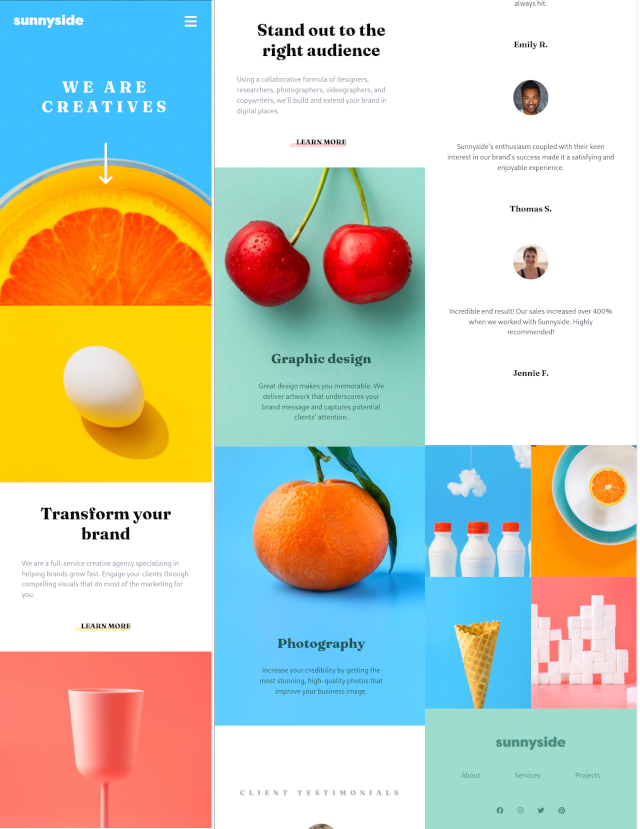

# Project Name

Project description or challenge: Building a Landing Page

## Table of Contents

-   [Project Overview](#project-overview)
-   [Skills Used](#skills-used)
-   [What I Learned](#what-i-learned)
-   [Areas for Improvement](#areas-for-improvement)
-   [Getting Started](#getting-started)
-   [Usage](#usage)
-   [Screenshots](#screenshots)
-   [Acknowledgments](#acknowledgments)

## Project Overview

This marks my effort to tackle Frontend Mentor challenges, with the goal of refining my coding skills through the hands-on creation of practical applications

## Skills Used

List the skills and technologies you utilized for this project. For example:

-   HTML5
-   CSS3 (Flexbox, Grid)
-   Sass
-   JavaScript
-   Responsive Design
-   Version Control/Git

## What I Learned

I initially faced some difficulty with using the grid, but after a few attempts, I managed to understand it. Achieving good responsiveness posed a learning challenge for me. I gained more insight into using media queries effectively and explored new CSS features like inline padding and the min(10vh, 5em) approach. This technique allows the borders to adjust smoothly as the window size changes. Furthermore, I delved into expanding my knowledge of Git for version control.

## Areas for Improvement

There's always more to enhance. I think I can use better class naming conventions, fine-tune the different media query sizes, and clean up the code. Additionally, there is room for improvement in optimizing the responsiveness of the webpage and implementing more advanced CSS features.

## Getting Started

Provide instructions on how to set up and run the project locally. Include any dependencies and prerequisites. For example:

1. Clone the repository.
2. In your terminal, run npm install
3. In your terminal, run npm run dev

## Usage

The landing page ought to be responsive, and the navigation should smoothly scroll to linked sections.

## Screenshots

## Acknowledgments

I relied on Kevin Powell's videos, which proved to be invaluable for learning and comprehending concepts that I implemented in the project.

[sass-made-easy](https://www.youtube.com/watch?v=wYWf2m_yzBQ&t=946s)
[Learn CSS Grid the easy way](https://www.youtube.com/watch?v=rg7Fvvl3taU)
